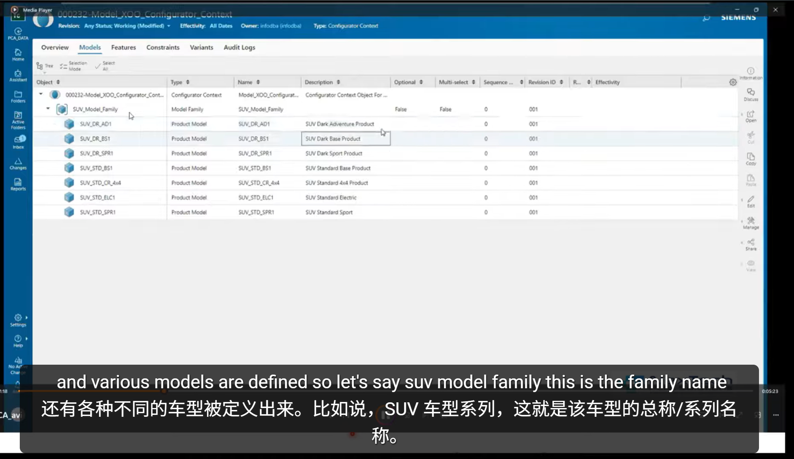
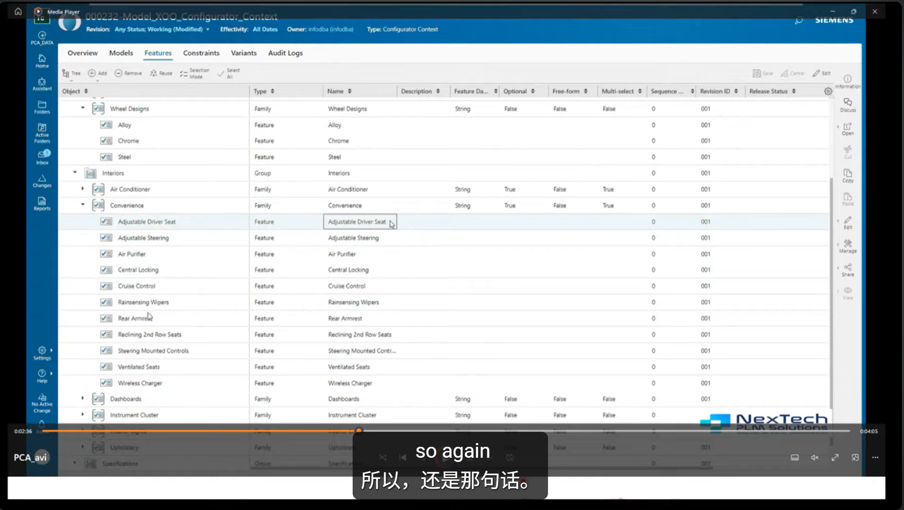

首先定义一个配置上下文（configurator_context）该段如图
底部包含了整个产品的产品簇比如说是SUV越野系列
整个产品簇下就是对应的各种产品比如suv标准版，suv越野版

在configurator_context的Feature下是来定义Family下的Feature特征，如图
Group定义为组比如说内饰（interiors）和外饰（exterior）
Group下则是定义的Family（Family是需要回答的配置问题，例如：座椅类型？便捷程度？车轮材质？）比如说在Interior内饰下会有空调（Air Conditioner）便捷（Convenience）仪表盘（Dashboards）等
而对应的Family下就是需要回答配置问题的Feature选项，例如在便捷（Convenience）这个Family下就有可调座椅（Adjustable Driver Seat）可调节方向盘（Adjustable Steering）等 当然Feature不可能总是简单的布尔数据类型，字符串，数字，日期，等数据类型。单选多选也可以设置，而且能标明是否为强制（Mandatory）配置或可选（Optional）项
Feature也需要注意会出现以技术角度和营销角度两种维度出现定义
